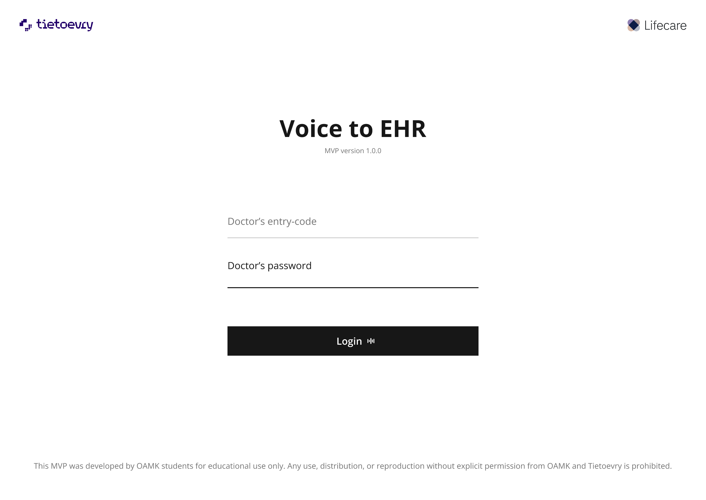

# Voice-to-EHR Teamwork Project

## Project Demo

Click the image below to watch a video demo of the Voice to EHR project:

[](https://www.youtube.com/watch?v=NejdSlW5hR8)

---

**This project was developed for the company Tietoevry by Shu Cheng and Hakan Asmaoglu.**

---

## Table of Contents
1. [Project Overview](#project-overview)
2. [Project Structure](#project-structure)
3. [Prerequisites](#prerequisites)
4. [Cloning the Repository](#cloning-the-repository)
5. [Environment Variables Setup](#environment-variables-setup)
6. [Installing Dependencies](#installing-dependencies)
7. [Running the Applications](#running-the-applications)
8. [Main User Flow Walkthrough](#main-user-flow-walkthrough)
9. [How to Test the Flow](#how-to-test-the-flow)
10. [How to Modify the Code](#how-to-modify-the-code)
    - [Modifying Patients and EHRs](#modifying-patients-and-ehrs)
    - [Modifying the UI](#modifying-the-ui)
    - [Modifying the AI Logic](#modifying-the-ai-logic)
11. [Best Practices for Contributing](#best-practices-for-contributing)
12. [Troubleshooting](#troubleshooting)
13. [Useful Commands](#useful-commands)
14. [Additional Resources](#additional-resources)
15. [FAQ](#faq)

---

## 1. Project Overview

**Voice-to-EHR** is a platform that allows healthcare professionals to record voice notes and automatically convert them into structured EHRs. The system leverages AI (Azure OpenAI) for transcription and analysis, and stores data securely using Supabase.

---

## 2. Project Structure

```
voice-to-ehr-teamwork/
  backend-nodejs/      # Node.js/Express backend
    src/
      routes/
      app.js
    package.json
    ...
  frontend/            # Next.js frontend
    app/
    components/
    pages/
    public/
    package.json
    ...
```

---

## 3. Prerequisites

Make sure you have the following installed:
- **Node.js** (v18 or later recommended)
- **npm** (comes with Node.js)
- **Git** (for cloning the repository)

Check with:
```bash
node -v
npm -v
git --version
```

---

## 4. Cloning the Repository

```bash
git clone <your-repo-url>
cd voice-to-ehr-teamwork
```

---

## 5. Environment Variables Setup

### Backend (`backend-nodejs/.env`):
```
PORT=5001
SUPABASE_URL=your_supabase_url
SUPABASE_SERVICE_ROLE_KEY=your_supabase_service_role_key
AZURE_OPENAI_DEPLOYMENT=your_azure_openai_deployment_name
AZURE_OPENAI_ENDPOINT=your_azure_openai_endpoint
AZURE_OPENAI_API_KEY=your_azure_openai_api_key
```

### Frontend (`frontend/.env.local`):
```
NEXT_PUBLIC_SUPABASE_URL=your_supabase_url
NEXT_PUBLIC_SUPABASE_SERVICE_ROLE_KEY=your_supabase_service_role_key
```

---

## 6. Installing Dependencies

### Backend
```bash
cd backend-nodejs
npm install
```

### Frontend
```bash
cd frontend
npm install
```

---

## 7. Running the Applications

### Backend
```bash
cd backend-nodejs
npm run dev
```
- Runs on [http://localhost:5001](http://localhost:5001)

### Frontend
```bash
cd frontend
npm run dev
```
- Runs on [http://localhost:3000](http://localhost:3000)

---

## 8. Main User Flow Walkthrough

### 1. **Login Page** (`frontend/app/page.tsx`)
- The app starts at the login page. Enter your credentials (or use the default if provided).
- The login form is handled by `LoginForm` in `frontend/components/auth/LoginForm.tsx`.

### 2. **Dashboard** (`frontend/app/(main)/dashboard/page.tsx`)
- After login, you are redirected to the dashboard, which lists all patients (using `PatientList`).
- Patient data is currently hardcoded or fetched from Supabase (see `frontend/app/api/patients/route.ts`).

### 3. **Patient Page** (`frontend/app/(main)/patient/[id]/page.tsx`)
- Click a patient to view their details and start a new EHR.
- You can record your voice, transcribe it, and then process it into a structured EHR.
- The voice recording and transcription logic is in `VoiceRecorder` and the EHR creation logic is in this page.

### 4. **EHR Creation and Review**
- After transcription, click "Start EHR" to send the text to the backend for AI analysis.
- The AI returns structured data (symptoms, diagnosis, treatment, etc.), which you can review and edit.
- You can accept AI suggestions or modify the fields manually.

### 5. **Saving the EHR**
- Once satisfied, save the EHR. It will be stored in Supabase and/or EHRbase (see backend `saveToEhr.js`).
- You can view previous EHRs for a patient.

### 6. **EHR Detail Page**
- View detailed EHRs at `/patient/[id]/ehr/create/view/[compositionId]/EHRDetailPage.tsx`.

---

## 9. How to Test the Flow

1. **Start both backend and frontend as described above.**
2. **Login** with the provided credentials or a test user.
3. **On the dashboard**, select a patient.
4. **On the patient page:**
   - Click "Record" and speak a test case (e.g., describe symptoms, diagnosis, and treatment).
   - Click "Transcript" to transcribe your voice.
   - Click "Start EHR" to process the transcript with AI.
   - Review the structured EHR, edit fields, and accept AI suggestions if needed.
   - Click "Save" to store the EHR.
5. **View saved EHRs** for the patient to confirm the flow works.
6. **Try edge cases:**
   - Provide incomplete or irrelevant text to see how the AI responds.
   - Test with different patients.
   - Try editing the EHR after AI processing.

---

## 10. How to Modify the Code

### Modifying Patients and EHRs
- **Patient List:**
  - Hardcoded in `frontend/app/api/patients/route.ts` as a static array. Replace or extend this with your own data or connect to a real database.
  - To add a patient, add an object to the `patients` array.
- **EHRs:**
  - EHRs are fetched and saved via Supabase. See `frontend/app/api/patients/[patientId]/ehrs/route.ts` for how EHRs are loaded and saved.
  - To change the EHR structure, modify the backend response in `backend-nodejs/src/routes/analysis.js` and the frontend form fields.

### Modifying the UI
- All UI components are in `frontend/components/`.
- Pages are in `frontend/app/`.
- To change the look or add new features, edit or add React components and pages.
- Use TailwindCSS for styling (see `frontend/styles/globals.css`).

### Modifying the AI Logic
- The AI prompt and logic are in `backend-nodejs/src/routes/analysis.js`:
  - The `systemPrompt` variable defines what the AI is asked to do. Edit this to change the instructions.
  - The Azure OpenAI model and endpoint are set via environment variables. To use a different model or provider, change the API call in this file.
  - To use a different AI provider, replace the Azure client code with your own API call.
- **Testing AI changes:**
  - Use the `/api/analysis/analyze` endpoint with different texts to see how the AI responds.
  - You can add mock cases in `backend-nodejs/src/routes/mockCases.json` for testing.

### Example: Changing the AI Prompt
In `backend-nodejs/src/routes/analysis.js`:
```js
const systemPrompt = `You are a medical text analyzer. ...`;
```
Edit this string to change what the AI is asked to do.

### Example: Adding a New Patient
In `frontend/app/api/patients/route.ts`:
```js
const patients: Patient[] = [
  { id_number: '123', name: 'New Patient', ehr_id: 'uuid-here' },
  // ...
];
```

---

## 11. Best Practices for Contributing
- **Branching:** Create a new branch for each feature or bugfix.
- **Commits:** Write clear, descriptive commit messages.
- **Testing:** Test your changes locally before pushing.
- **Pull Requests:** Open a pull request and describe your changes.
- **Code Style:** Follow the existing code style and use Prettier/ESLint if configured.
- **Documentation:** Update the README or add comments for any new features or changes.

---

## 12. Troubleshooting
- **Missing modules:** Run `npm install` in both `backend-nodejs` and `frontend`.
- **Port already in use:** Change the `PORT` in your `.env` file or stop the conflicting service.
- **Environment variable errors:** Double-check your `.env` and `.env.local` files.
- **Supabase/Azure errors:** Ensure your credentials are correct and your services are active.
- **CORS issues:** Make sure the backend allows requests from the frontend's origin.
- **Frontend not connecting to backend:** Ensure both servers are running and the ports match.

---

## 13. Useful Commands
- `npm run dev` — Start in development mode (hot reload)
- `npm run build` — Build for production
- `npm start` — Start in production mode

---

## 14. Additional Resources
- [Next.js Documentation](https://nextjs.org/docs)
- [Express Documentation](https://expressjs.com/)
- [Supabase Documentation](https://supabase.com/docs)
- [Azure OpenAI Documentation](https://learn.microsoft.com/en-us/azure/cognitive-services/openai/)
- [Node.js Documentation](https://nodejs.org/en/docs)

---

## 15. FAQ

**Q: Do I need to run both frontend and backend?**
- Yes. The frontend provides the user interface, and the backend handles data processing and storage.

**Q: Where do I get Supabase and Azure credentials?**
- You must create accounts on [Supabase](https://supabase.com/) and [Azure OpenAI](https://azure.microsoft.com/en-us/products/ai-services/openai-service/) and set up the required services. Follow their documentation for setup.

**Q: Can I change the ports?**
- Yes. Change the `PORT` variable in your `.env` files as needed, but make sure the frontend knows where to find the backend.

**Q: How do I stop the servers?**
- Press `Ctrl+C` in the terminal window where the server is running.

**Q: How do I add new features or change the AI?**
- See the [How to Modify the Code](#how-to-modify-the-code) section above for detailed instructions.

---

If you have any questions about this project, please contact the developers Shu Cheng and Hakan Asmaoglu.